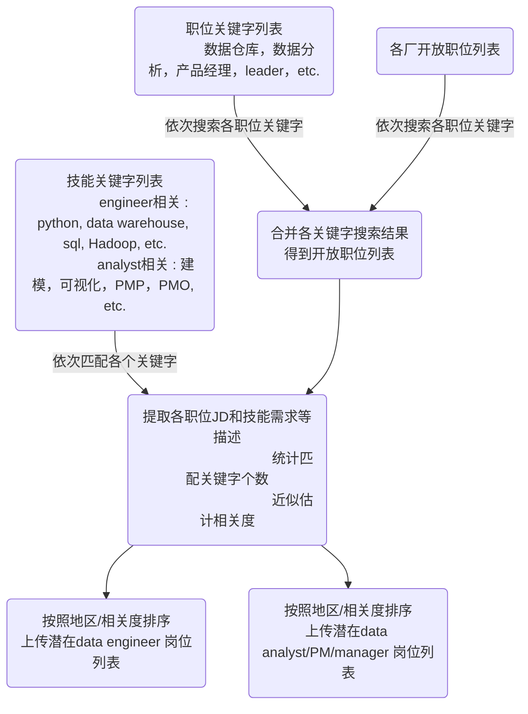

希望以此结果，能大家在各个大厂内尽快筛选到尽可能匹配的岗位。

### 各厂入口

#### 字节
* 已上传，不定期更新 * [官网入口](https://jobs.bytedance.com/experienced/position)
* [byteDance-data-analyst.md](./src/byteDance-data-analyst.md)
* [byteDance-data-engineer_part1.md](./src/byteDance-data-engineer_part1.md)
* [byteDance-data-engineer_part2.md](./src/byteDance-data-engineer_part2.md)

#### 腾讯
* 已上传，不定期更新 * [官网入口](https://careers.tencent.com/zh-cn/search.html)
* [tencent-data-analyst.md](./src/tencent-data-analyst.md)
* [tencent-data-engineer.md](./src/tencent-data-engineer.md)


#### 哔哩哔哩
* 已上传，不定期更新 * [官网入口](https://jobs.bilibili.com/social/positions?location=%E4%B8%8A%E6%B5%B7&type=3)
* [bilibili-data-analyst.md](./src/bilibili-data-analyst.md)
* [bilibili-data-engineer.md](./src/bilibili-data-engineer.md)

#### 京东
* 已上传，不定期更新 * [官网入口](https://zhaopin.jd.com/web/job/job_info_list/3)
* [jd-data-analyst.md](./src/jd-data-analyst.md)
* [jd-data-engineer.md](./src/jd-data-engineer.md)


#### 顺丰
* 已上传，不定期更新 * [官网入口](https://hr.sf-express.com/jobMainHandler/main/9999)
* [sf_Express-data-analyst.md](./src/sf_Express-data-analyst.md)
* [sf_Express-data-engineer.md](./src/sf_Express-data-engineer.md)


#### 蚂蚁
* 已上传，不定期更新 * [官网入口](https://talent.antgroup.com/off-campus)
* [antGroup-data-analyst.md](./src/antGroup-data-analyst.md)
* [antGroup-data-engineer.md](./src/antGroup-data-engineer.md)


#### 携程
* 已上传，不定期更新 * [官网入口](https://job.ctrip.com/index.html#/jobList)
* [ctrip-data-analyst.md](./src/ctrip-data-analyst.md)
* [ctrip-data-engineer.md](./src/ctrip-data-engineer.md)

#### 希尔顿
* 已上传，不定期更新
* [Hilton.md](./src/Hilton.md)


#### 叠纸游戏
* 已上传，不定期更新
* [叠纸游戏.md](./src/叠纸游戏.md)


#### 盒马
* 已上传，不定期更新
* [盒马Freshippo.md](./src/盒马Freshippo.md)


#### 更多公司
* 已上传，不定期更新
* [more-data-related-jobs.md](./src/more-data-related-jobs.md)

#### 进度条
|厂名|进度|入口|
|-----|-----|------|
|网易|TODO|[入口](https://hr.163.com/)|
|百度|TODO|[入口](https://talent.baidu.com/jobs/social-list)|
|Vivo|TODO|[入口](https://hr.vivo.com/jobs?_p=2&_irjl=%E4%B8%8A%E6%B5%B7)|
|美团|TODO|[入口](https://zhaopin.meituan.com/web/social)|
|拼多多|TODO|[入口](https://careers.pddglobalhr.net/jobs)|
|米哈游|TODO|[入口](https://jobs.mihoyo.com/)|
|华为|TODO|[入口](https://career.huawei.com/reccampportal/portal5/campus-recruitment.html)|
|海尔|TODO|[入口](http://vta.maker.haier.net/client/mobile/sociallist.html)|
|苏宁|TODO|[入口](http://careers.suning.cn/rps-web/position/show_position_new.htm?type=1)|
|阿里|TODO|[入口](https://talent.alibaba.com/off-campus/position-list?lang=zh)|
|沃尔玛|TODO|[入口](https://walmartchina.avature.cn/zh_CN/storecareers/SearchJobsInSams/?6039=953&6039_format=3360&6040=920&6040_format=3361&listFilterMode=1&jobRecordsPerPage=6&jobOffset=0)]
|海信|TODO|[入口](http://hisense.zhiye.com/sz)|


### 使用提示
*  通过匹配列表，筛选更适合的职位，无论是和HR，内推，还是和猎头沟通，都能更有针对性。
*  除了通过猎头推荐，直接向官网投递简历也是一种方式。
*  对心仪的岗位，不定期重复投递简历，有时能起到意想不到的效果。

#### 伸缩文件列表以更改页面布局


#### 点击边栏的职位信息跳转，在Web端打开能看到完整页面
```
以地区和相关匹配度依次排序
点击职位描述页面以获取完整信息
```


#### 处理思路
```
1. 在各厂求职页面，依次搜索各 * * 职位* *  关键字，并合并搜索结果
2. 按照data engineer 和 analyst/PM 这两个大类， * * 组织技能匹配关键字* *  
3. 对于合并后列表内的每个职位，依次搜索技能匹配关键字，并统计命中数
*  对于统计后的结果做相关度筛选，按照1）地区 2）匹配命中数做排序展示
```


